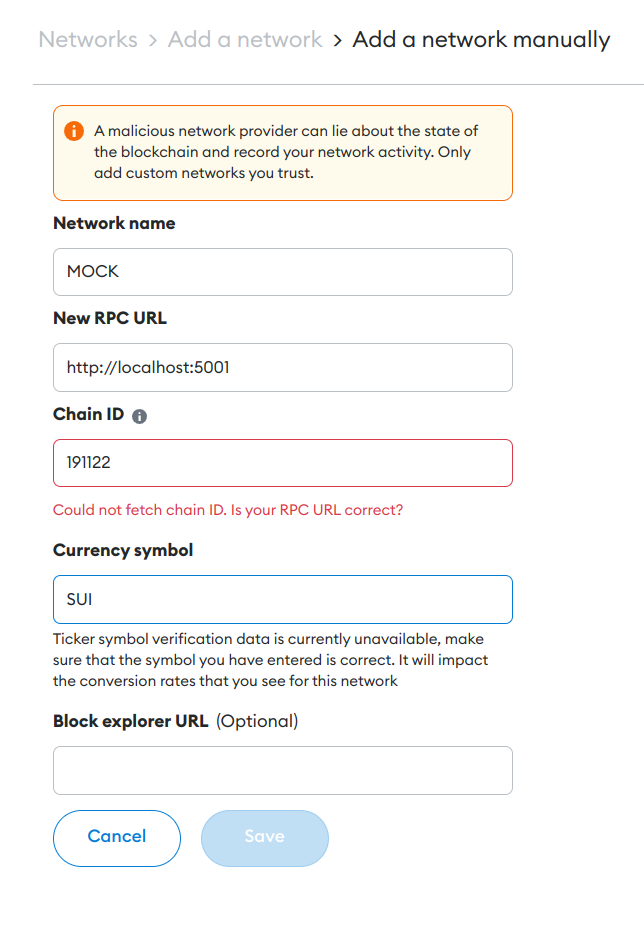

# Mock Proxy
You are expected to create a mock proxy server in Rust. 

## Your Task
Your task is to create a simple Proxy server as mentioned in our [light paper](https://lime-guavaberry-e75.notion.site/EVM-on-Sui-Technical-Lite-Paper-97cd8093f29447159cc19b6b0e1ea068) but with mock blockchain backend. Your proxy receives [Ethereum API](https://docs.alchemy.com/reference/ethereum-api-quickstart) request and sends back response as if it is connected to real Sui blockchain. For simplicity, in this task, you don't need to implement all APIs. Your goal here is making Metamask work with your Proxy such that you can send **a transfer transaction** ([Regular transaction here](https://ethereum.org/en/developers/docs/transactions/#types-of-transactions)).

If the implementation is incomplete, you will see error messages appear on any parts of the Metamask screen. You are expected to remove all of such errors so that end users will be certain that they are connected to a "real" EVM-compatible blockchain.

On evaluation, we will add your proxy server running on localhost as a custom network in Network setting page in Metamask, with the following configuration:

- Network Name: `MOCK`
- RPC URL: `http://localhost:5001`
- Chain ID: `191122`
- Currency Symbol: `SUI`

Instruction on how to run should be documented. Documentation requirements is explained in detail in later section.

### What is NOT your task
- No need to implement ALL Ethereum API Endpoints
- No need to interact with Sui network
- No need to call your mock backend with [Sui's API](https://docs.sui.io/sui-jsonrpc).
- No need to handle send_transaction requests other than of simple transfer. In other words, you're not expected to receive transaction requests with contract executions such as ERC20 transfer.
- No need to update crypto balance after transfer transaction is confirmed. Your mock is stateless service.

## Tech Stack and Requirement
- use [Rust](https://rustup.rs/) programming language
- use [tokio](https://tokio.rs/) as asynchronous runtime
- document what your code does in `docs/proxy.md` file written in [markdown](https://daringfireball.net/projects/markdown/). Your document should explain justification of your architecture and any of your technical choices. Also, instruction of how to run it locally should be documented.
- Your Ethereum transaction is formattd as legacy transaction, which had been an only transaction format before [EIP2718](https://github.com/ethereum/EIPs/blob/master/EIPS/eip-2718.md) was introduced.

## What we see
- precise understanding of our Proxy product
- ability to build Proxy from scratch
- ability to write a good code: robust architecture with high modularity, proper level of abstraction, readablity and maintainability, security and safety, conformity to rust-lang norms
- understanding of inner-workings of Ethereum Wallet
- ability to document and share your work in plain English 
- quick learning skills

## Warning
This task may be assigned to other people at the same time or in the future. You **MUST NOT** disclose any information related to this task with anyone. And you **MUST NOT** share this on social media or any kinds. You're required to work this task alone.

## Submission
You will create a new branch in this repository. branch name should be `submission/<YOUR_GITHUB_ID>`, where `<YOUR_GITHUB_ID>` is your github username(not your email!). Your final code should be pushed to this branch. Works on any other branch is not evaluated.

## Deadline
**12:00 a.m. midnight(your local timezone)** of the day such that you can commit to this task for at least **seven-consective days** counted from the day this task is assigned. Any commits with timestamp after the deadline is not evaluated.

## Questions
Any questions and trouble should be reported to Telegram group.